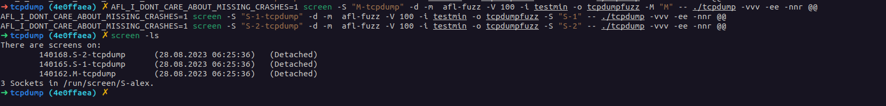
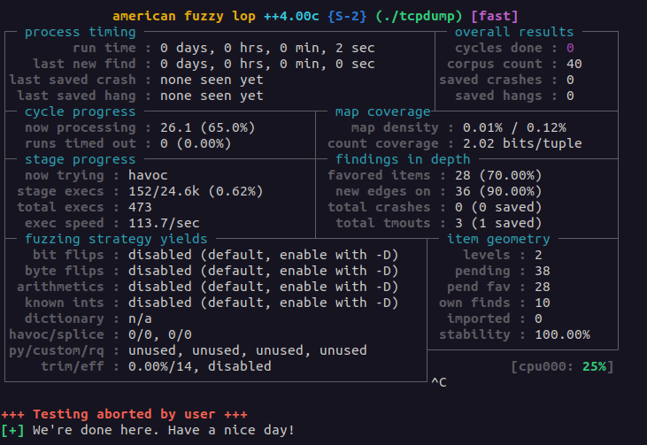
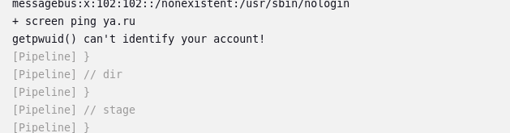
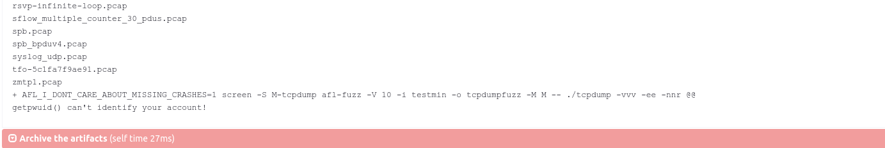
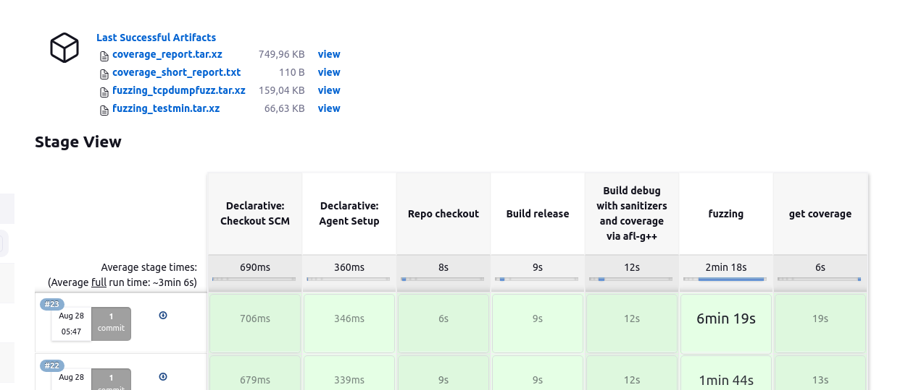
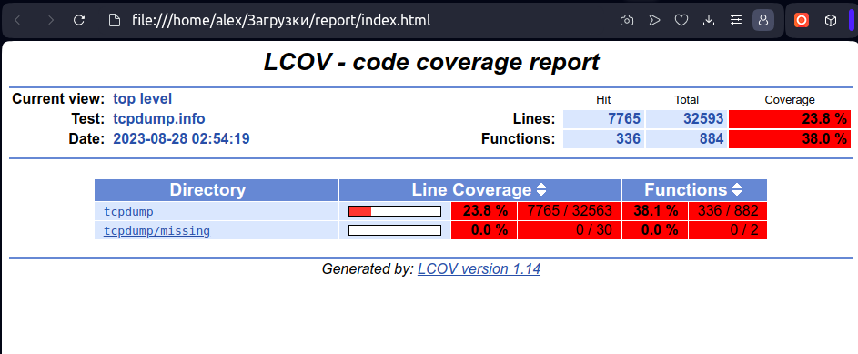
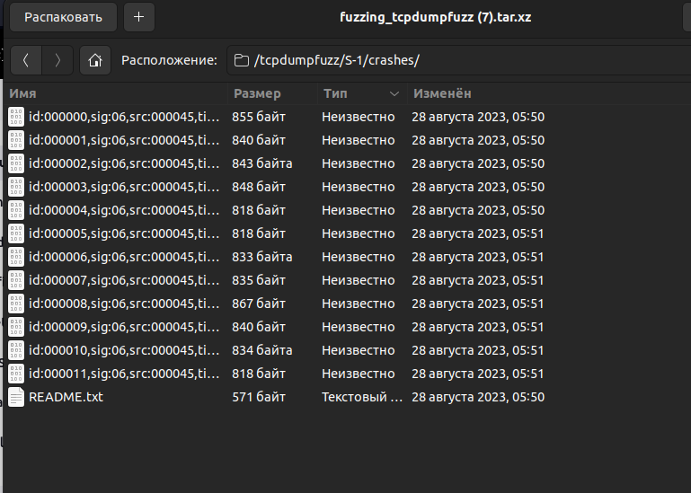

Отчет по Т2 ПЗ 1\
Винников Алексей\
Задание 3\
Вариант 1


Все необходимые фиксы исходного кода необходимые для фаззинга, сборки с санитайзерами и сбора покрытия описаны в [ПР2](https://github.com/alex-12345/jenkins_tcpdump/blob/lab2/README.md) 


### Отчетные материалы ПР3 ###

Полная последовательность команд представлена в [Jenkinsfile](./Jenkinsfile)

Оставлю некоторые комментарии

Необходимая сборка компилятора осуществляется в фазе `Build debug with sanitizers and coverage via afl-g++` для сборки используется компилятор `afl-gcc`

Передаются следующие флаги

```Bash
-fsanitize=address \ # включаем сантиайзер на отслеживание утечек памяти, неправильных адресов и прочего
-fsanitize=undefined \ #включаем санитайзер отслеживающий undefined behavior ситации
-O0 \ # выключаем оптимизации
-g3 \ # включаем отладочную инфу
--coverage # собираем покрытие (профиль)

```

Полностью команда следующая
```Bash
export USER_BUILD_FLAGS="-fsanitize=address -fsanitize=undefined -O0 -g3 --coverage" && AFL_USE_UBSAN=1 AFL_USE_ASAN=1 CC=afl-gcc CXX=afl-g++ CFLAGS="$USER_BUILD_FLAGS" CXXFLAGS="$USER_BUILD_FLAGS" LDFLAGS="$USER_BUILD_FLAGS" ./configure
                    make -j$(nproc)
```


Далее к корпусу входных документов

Позаимствовал идею [отсюда](https://www.youtube.com/watch?v=iXCthIsxrz8&t=1s) Так как входными данными являются данные в бинарном формате pcap то сложно что то быстро придумать

Взял исходные тесты (которые выполнились успешно) из папки tests проекта и прогнал их через минимизатор afl-cmin.bash

```Bash
git apply ../patches/testlist.fix.patch # убарали нерабочие тесты
afl-cmin.bash -i tests/ -o testmin -m none -- ./tcpdump -nnr @@ 
# Здесь -i входная директория 
#       -o выходная директория 
#       -m лимит по памяти
#       -nnr флаг что происходит чтение из файла для tcpdump
```

Пример выполнения этого скрипта (на локальной машине) можно видеть на скриншоте


После чего запускаем фаззинг следующими командами в паралельном режиме

```Bash
AFL_I_DONT_CARE_ABOUT_MISSING_CRASHES=1 screen -S "M-tcpdump" -d -m  afl-fuzz -V 100 -i testmin -o tcpdumpfuzz -M "M" -- ./tcpdump -vvv -ee -nnr @@
AFL_I_DONT_CARE_ABOUT_MISSING_CRASHES=1 screen -S "S-1-tcpdump" -d -m  afl-fuzz -V 100 -i testmin -o tcpdumpfuzz -S "S-1" -- ./tcpdump -vvv -ee -nnr @@
AFL_I_DONT_CARE_ABOUT_MISSING_CRASHES=1 screen -S "S-2-tcpdump" -d -m  afl-fuzz -V 100 -i testmin -o tcpdumpfuzz -S "S-2" -- ./tcpdump -vvv -ee -nnr @@
# Здесь -S "M-tcpdump" - имя сокета для screen
#       -d -m (включаем detach и игнорируем ошибки связанные с $STY) 
# Для afl-fuzz
#       -V 100 время выполнения 100 сек
#       -S/M - Идетификация процесса (имя master/slave)
#       -i входная директория 
#       -o выходная директория 
# Для  tcpdump
#       -vvv -ee (печатаем максимальную отладочную информацию и ошибки)
#       -nnr читаем из файла

```
Пример работы на локальной машине



Графическое окно фазера можно увидеть на скриншоте ниже 



**В Jenkins возникла проблема с идентификации пользователя для screen**  (См скриншоты ниже)





В результате в jenkins пришлось отказаться от потоков и там выполгняется такой же код только без screen 

**Это единственное место в Jenkins которое отличается от запуска на локальной пашине**

```Bash 
 AFL_I_DONT_CARE_ABOUT_MISSING_CRASHES=1 afl-fuzz -V 100 -i testmin -o tcpdumpfuzz -M "M" -- ./tcpdump -vvv -ee -nnr @@
AFL_I_DONT_CARE_ABOUT_MISSING_CRASHES=1 afl-fuzz -V 100 -i testmin -o tcpdumpfuzz -S "S-1" -- ./tcpdump -vvv -ee -nnr @@
AFL_I_DONT_CARE_ABOUT_MISSING_CRASHES=1 afl-fuzz -V 100 -i testmin -o tcpdumpfuzz -S "S-2" -- ./tcpdump -vvv -ee -nnr @@
# Здесь для afl-fuzz
#       -V 100 время выполнения 100 сек
#       -S/M - Идетификация процесса (имя master/slave)
#       -i входная директория 
#       -o выходная директория 
# Для  tcpdump
#       -vvv -ee (печатаем максимальную отладочную информацию и ошибки)
#       -nnr читаем из файла

```

Далее проходимся по очередям фаззинга чтобы собрать профиль для оценки покрытия тестам. Из-за особеностей Jenkins его пришлось выделить в отдельный скрипт [get_covarege.sh](scripts/get_covarege.sh)

```Bash
for F in $PWD/tcpdumpfuzz/M/queue/*; do ./tcpdump -vvv -ee -nnr $F || true; done
for F in $PWD/tcpdumpfuzz/S-1/queue/*; do ./tcpdump -vvv -ee -nnr $F || true; done
for F in $PWD/tcpdumpfuzz/S-2/queue/*; do ./tcpdump -vvv -ee -nnr $F || true; done
```

После того как профиль собрам запускаем генерацию отчета уже описанным во второй ПР способом через lcov

```Bash
lcov -t "tcpdump" -o tcpdump.info -c -d .
genhtml -o report tcpdump.info | tail -n3 > coverage_short_report.txt
```

Как результат в Jenkins после сборки имеем 4 файла (см скришот ниже)
- coverage_report.tar.xz - html отчеты покрытия
- coverage_short_report.txt - информация об общем проценте покрытия
- fuzzing_tcpdumpfuzz.tar.xz	- выходные данные фазера
- fuzzing_testmin.tar.xz	- минимизированный корпус входных документов




Посмотрим html отчеты



По результату видно что удалось по сравнению со второй ПР повысить покрытие кода с 18.6% до 23.8 %, функций - с 31.9% до  38.0 %

**Для файзера запущенного на виртуальной машине в докере считаю что это неплохой резульат**

Также в процессе фазинга были собраны краши, их можно увидеть в архиве fuzzing_tcpdumpfuzz.tar.xz 



Все описанное работает в Jenkins необходимо только создать pipeline указав данный репо и ветку


