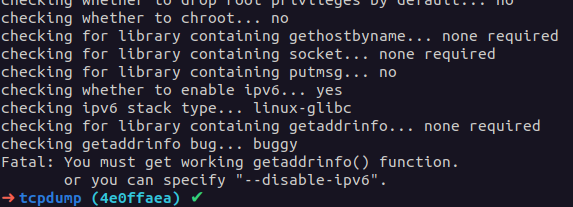
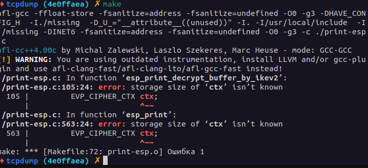
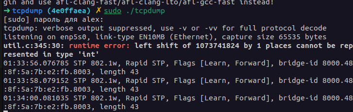

Отчет по Т2 ПЗ 1\
Винников Алексей\
Задание 2\
Вариант 1

### Исправление недочетов 1 практической работы ###

В рамках первой практической работы мною был сделан анализ покрытия кода встроенными тестами. Который должен был выполнятся в рамках второй (данной) практической работы. Однако помимо этого были допущены некоторые вещи которые небоходимо исправить.

#### 1. Некорректный результат тестов в отладной сборке ####

В сборке с сантийзерами падали почти все тесты (см скриншот ниже).
Это было связано с тем что отладночная версия собиралась клангом и в случае проблемы с ipv6 clang просто проигнорировал ее. Теперь отладочная версия собирается с помоощью gcc так

```Bash
export USER_BUILD_FLAGS="-fsanitize=address -fsanitize=undefined -O0 -g3" && AFL_USE_UBSAN=1 AFL_USE_ASAN=1 CC=afl-gcc CXX=afl-g++ CFLAGS="$USER_BUILD_FLAGS" CXXFLAGS="$USER_BUILD_FLAGS" LDFLAGS="$USER_BUILD_FLAGS" ./configure
```

Проблема при сборке таким образом сразу же отображается



Данная проблема уходит в версии tcpdump-4.8.0. По анализу коммитов был сделан патч [fix_disableipv6.patch](patches/fix_disableipv6.patch)

он применяется в Dockerfile так
```Bash
git apply patches/fix_disableipv6.patch
```

Также если уставлен openssl появляяется такая ошибка 



Ее также можно пофиксить созданным мною патчем [fix_ssl_build.patch](patches/fix_ssl_build.patch)

```Bash
git apply /patches/fix_ssl_build.patch
```

При каждом запуске для сборка трафика появлялась следующая ошибка



Ее также можно пофиксить созданным мною патчем [utilc.fix.patch](patches/utilc.fix.patch)

```Bash
git apply /patches/utilc.fix.patch
```

Теперь после запуска тестов для отладочной версии падают только 7 тестов как и в релизной версии. Вывод можно увидеть в файле [ilustrate_output/sanitizer_make_check.txt](ilustrate_output/sanitizer_make_check.txt)

Там видно что падают 7 тестов. Согласно данном [issue](https://github.com/the-tcpdump-group/tcpdump/issues/381) Проблема ведет к openssl1.0-dev. Однако ее нельзя напрямую поставить через `apt`. После скачивания и установки напрямую

```bash
wget http://launchpadlibrarian.net/668090209/libssl1.0.0_1.0.2n-1ubuntu5.13_i386.deb
wget http://launchpadlibrarian.net/668090205/libssl1.0-dev_1.0.2n-1ubuntu5.13_i386.deb
sudo apt install ./libssl1.0.0_1.0.2n-1ubuntu5.13_i386.deb
sudo apt install ./libssl1.0-dev_1.0.2n-1ubuntu5.13_i386.deb
```

Результат стал лучше (теперь он не просто игнорирует входные данные, а выдает правильный результат хоть и не достаточно полный). Такойже как и в этом [issue](https://giters.com/mcr/tcpdump/issues/33)

Неполна выглядит примерно так

```
< IP 192.1.2.23.4500 > 192.1.2.45.4500: UDP-encap: ESP(spi=0x12345678,seq=0x2), length 116
< IP 192.1.2.23.4500 > 192.1.2.45.4500: UDP-encap: ESP(spi=0x12345678,seq=0x3), length 116
---
> IP 192.1.2.23.4500 > 192.1.2.45.4500: UDP-encap: ESP(spi=0x12345678,seq=0x2), length 116:  ip-proto-227 49
> IP 192.1.2.23.4500 > 192.1.2.45.4500: UDP-encap: ESP(spi=0x12345678,seq=0x3), length 116: PIMv13, length 10
```

Учитывая дату ошибки (11 лет назад) скорее всего данную ошибку будет очень сложно исправить (так как окружение в современном дистрибутиве отличается колоссально)

В дальнейшем для отключения данных тестов используется патч [testlist.fix.patch](patches/testlist.fix.patch)

```Bash
git apply patches/testlist.fix.patch
```


### Отчетные материалы ПР2 ###

#### 1. Описать порядок сборки ОО с инструментацией для анализа покрытия кода (команды сборки ОО с инструментацией для анализа покрытия кода, содержимое docker-файла). ####

Отладочная сборка для анализа покрытия с санитайзерами осуществляется так:

```Bash
export USER_BUILD_FLAGS="-fsanitize=address -fsanitize=undefined -O0 -g3 --coverage" && AFL_USE_UBSAN=1 AFL_USE_ASAN=1 CC=afl-gcc CXX=afl-g++ CFLAGS="$USER_BUILD_FLAGS" CXXFLAGS="$USER_BUILD_FLAGS" LDFLAGS="$USER_BUILD_FLAGS" ./configure
make -j$(nproc) # собираем
```

Предварительно применяются необходимые патчи:

```
git apply /patches/fix_disableipv6.patch
git apply /patches/fix_ssl_build.patch
git apply /patches/utilc.fix.patch
```

Папка patches пробрасывается в Dockerfile из данного репозитория

#### 2. Описать порядок запуска тестирования и оценки покрытия кода (команды запуска тестирования, содержимое docker-файла, представить результаты анализа покрытия кода). ####

Cбор покрытия осуществляется следующей последовательностью команд:

```Bash
make check > coverage_report.txt # запускаем тесты и записываем вывод
lcov -t "tcpdump" -o tcpdump.info -c -d . # собираем данные gcda
genhtml -o report tcpdump.info | tail -n3 > coverage_short_report.txt # генерируем html отчет и процент покрытия в тесктовом варианте
tar cJf coverage_report.tar.xz report # архивируем полученные html отчеты
```
####  3. Описать порядок запуска тестирования для ОО со встроенными датчиками ошибок (команды запуска тестирования, содержимое docker-файла). #### 

Аналигично пункту 1 только без флага --coverage

####   4. Описать ключевые особенности сбора покрытия, описать особенности текущего покрытия кода тестами (скриншоты, артефакты). ####  

Открыв html отчет видим следующую картину:


Строки кода покрыты тестами на 18.6%
Функции - на 31.9%

Можно полазить по отчетам и посмотреть какие именно участки кода и файлы вообще были покрыты


#### 5. Описать порядок добавления заданий на сборку и анализ покрытия в CI/CD системе Jenkins. ####

Как и первой практической работе пайплаин создан как Pipline script from SCM но уже из ветки lab2


